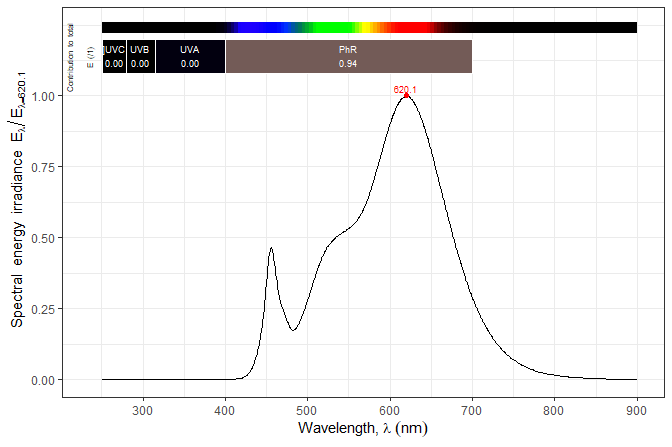

# photobiologyLEDs 

<!-- badges: start -->

[](https://cran.r-project.org/package=photobiologyLEDs)
[](https://cran.r-project.org/web/checks/check_results_photobiologyLEDs.html)
[](https://github.com/aphalo/photobiologyLEDs/actions)
<!-- badges: end -->

Package ‘**photobiologyLEDs**’ complements other packages in the [*R for
photobiology* suite](https://www.r4photobiology.info/). It contains
spectral emission data for diverse types of light emitting diodes (LEDs)
and LED arrays (`leds.mspct`). It also includes spectra from a COB LED
when dimmed using the constant current approach (`COB_dimming.mspct`)
and for a COB LED combined with reflectors with different beam angles
(`COB_reflectors.mspct`).

This package contains only data. Data are stored as collections of
spectra of class `source_mspct` from package ‘photobiology’, which is
the core of the [*R for photobiology*
suite](https://www.r4photobiology.info/). Spectra can be easily plotted
with functions and methods from package
[‘ggspectra’](https://docs.r4photobiology.info/ggspectra/). The spectra
can be used seamlesly with functions from package
[‘photobioloy’](https://docs.r4photobiology.info/photobiology/).
However, class `source_mspct` is derived from `list` and class
`source_spct` is derived from `data.frame` making the data also usable
as is with base R functions.

## Examples

``` r
library(ggspectra)
library(photobiologyLEDs)
```

How many spectra are included in the current version of
‘photobiologyFilters’?

``` r
length(leds.mspct)
#> [1] 74
```

``` r
length(COB_dimming.mspct)
#> [1] 8
```

``` r
length(COB_reflectors.mspct)
#> [1] 4
```

What are the names of available spectra. We use `head()` to limit the
output.

``` r
# list names of the first 10 LEDs
head(names(leds.mspct), 10)
#>  [1] "Agilent_HLMB_CB30"  "Agilent_HLMB_CD31"  "Agilent_HLMP_CB31" 
#>  [4] "Agilent_HLMP_CM30"  "Agilent_HLMP_CM31"  "Agilent_HLMP_DJ32" 
#>  [7] "Agilent_HLMP_DL32"  "Bridgelux_3W_450nm" "CREE_XPE_480nm"    
#> [10] "Epileds_3W_410nm"
```

To subset based on different criteria we can use predefined character
vectors of LED names. For example, vector `nichia_leds` lists the names
of the spectra for filters made by NIchia.

``` r
Nichia_leds
#> [1] "Nichia_NVSU233B_U365"            "Nichia_NVSU119C_U385"           
#> [3] "Nichia_NFSW757G_Rsp0a"           "Nichia_NFSL757GT_Rsp0a"         
#> [5] "Nichia_NFCWL036B_V3_Rfcb0"       "Nichia_NF2W757GT_F1_sm505_Rfc00"
#> [7] "Nichia_unknown_757"              "Nichia_NS6L183AT_H1_sw"
```

We can use the vector to extract all these spectra as a collection.

``` r
leds.mspct[Nichia_leds]
#> Object: source_mspct [8 x 1]
#> --- Member: Nichia_NVSU233B_U365 ---
#> Object: source_spct [1,313 x 2]
#> Wavelength range 251.29 to 900 nm, step 1.023182e-12 to 7.53 nm 
#> Label: LED type NVSU233B_U365 from Nichia 
#> Measured on 2021-10-09 22:35:17 UTC 
#> Time unit 1s
#> Spectral data normalized to 1 at 366.03 nm 
#> 
#> # A tibble: 1,313 x 2
#>    w.length s.e.irrad
#>       <dbl>     <dbl>
#>  1     251.         0
#>  2     256.         0
#>  3     257.         0
#>  4     257.         0
#>  5     257.         0
#>  6     258.         0
#>  7     258.         0
#>  8     259.         0
#>  9     259.         0
#> 10     260.         0
#> # ... with 1,303 more rows
#> --- Member: Nichia_NVSU119C_U385 ---
#> Object: source_spct [1,269 x 2]
#> Wavelength range 251.29 to 900 nm, step 1.023182e-12 to 7.52 nm 
#> Label: LED type NVSU119C_U385 from Nichia 
#> Measured on 2021-10-09 22:29:03 UTC 
#> Time unit 1s
#> Spectral data normalized to 1 at 385.25 nm 
#> 
#> # A tibble: 1,269 x 2
#>    w.length s.e.irrad
#>       <dbl>     <dbl>
#>  1     251.         0
#>  2     254.         0
#>  3     254.         0
#>  4     256.         0
#>  5     257.         0
#>  6     257.         0
#>  7     257.         0
#>  8     258.         0
#>  9     258.         0
#> 10     259.         0
#> # ... with 1,259 more rows
#> --- Member: Nichia_NFSW757G_Rsp0a ---
#> Object: source_spct [568 x 2]
#> Wavelength range 251.16 to 900 nm, step 1.023182e-12 to 7.59 nm 
#> Label: LED type NFSW757G_Rsp0a from Nichia 
#> Measured on 2019-06-25 14:03:10 UTC 
#> Time unit 1s
#> Spectral data normalized to 1 at 451.3 nm 
#> 
#> # A tibble: 568 x 2
#>    w.length s.e.irrad
#>       <dbl>     <dbl>
#>  1     251.         0
#>  2     259.         0
#>  3     260.         0
#>  4     261.         0
#>  5     261.         0
#>  6     263.         0
#>  7     263.         0
#>  8     263.         0
#>  9     264.         0
#> 10     266.         0
#> # ... with 558 more rows
#> --- Member: Nichia_NFSL757GT_Rsp0a ---
#> Object: source_spct [645 x 2]
#> Wavelength range 251.16 to 900 nm, step 1.023182e-12 to 7.59 nm 
#> Label: LED type NFSL757GT_Rsp0a from Nichia 
#> Measured on 2019-06-25 14:07:51 UTC 
#> Time unit 1s
#> Spectral data normalized to 1 at 622.27 nm 
#> 
#> # A tibble: 645 x 2
#>    w.length s.e.irrad
#>       <dbl>     <dbl>
#>  1     251.         0
#>  2     252.         0
#>  3     252.         0
#>  4     253.         0
#>  5     253.         0
#>  6     255.         0
#>  7     258.         0
#>  8     258.         0
#>  9     259.         0
#> 10     266.         0
#> # ... with 635 more rows
#> --- Member: Nichia_NFCWL036B_V3_Rfcb0 ---
#> Object: source_spct [796 x 2]
#> Wavelength range 251.29 to 900 nm, step 1.023182e-12 to 7.55 nm 
#> Label: LED type NFCWL036B_V3_Rfcb0 from Nichia 
#> Measured on 2021-10-09 20:43:51 UTC 
#> Time unit 1s
#> Spectral data normalized to 1 at 458.44 nm 
#> 
#> # A tibble: 796 x 2
#>    w.length s.e.irrad
#>       <dbl>     <dbl>
#>  1     251.         0
#>  2     254.         0
#>  3     254.         0
#>  4     256.         0
#>  5     257.         0
#>  6     259.         0
#>  7     259.         0
#>  8     260.         0
#>  9     260.         0
#> 10     261.         0
#> # ... with 786 more rows
#> --- Member: Nichia_NF2W757GT_F1_sm505_Rfc00 ---
#> Object: source_spct [729 x 2]
#> Wavelength range 251.16 to 900 nm, step 1.023182e-12 to 7.59 nm 
#> Label: LED type NF2W757GT_F1_sm505_Rfc00 from Nichia 
#> Measured on 2019-06-25 14:22:46 UTC 
#> Time unit 1s
#> Spectral data normalized to 1 at 419.18 nm 
#> 
#> # A tibble: 729 x 2
#>    w.length s.e.irrad
#>       <dbl>     <dbl>
#>  1     251.         0
#>  2     252.         0
#>  3     253.         0
#>  4     254.         0
#>  5     254          0
#>  6     259.         0
#>  7     266.         0
#>  8     271.         0
#>  9     272.         0
#> 10     274.         0
#> # ... with 719 more rows
#> --- Member: Nichia_unknown_757 ---
#> Object: source_spct [526 x 3]
#> Wavelength range 250.14 to 900 nm, step 1.023182e-12 to 7.59 nm 
#> Label: LED type unknown_757 from Nichia 
#> Measured on 2016-09-14 16:19:00 UTC 
#> Time unit 1s
#> Spectral data normalized to 1 at 454.48 nm 
#> 
#> # A tibble: 526 x 3
#>    w.length s.e.irrad s.e.irrad.good
#>       <dbl>     <dbl>          <dbl>
#>  1     250.         0              0
#>  2     251.         0              0
#>  3     252.         0              0
#>  4     258.         0              0
#>  5     265.         0              0
#>  6     273.         0              0
#>  7     281.         0              0
#>  8     288.         0              0
#>  9     296.         0              0
#> 10     303.         0              0
#> # ... with 516 more rows
#> --- Member: Nichia_NS6L183AT_H1_sw ---
#> Object: source_spct [904 x 2]
#> Wavelength range 251.29 to 900 nm, step 1.023182e-12 to 7.48 nm 
#> Label: LED type NS6L183AT_H1_sw from Nichia 
#> Measured on 2021-10-09 20:15:17 UTC 
#> Time unit 1s
#> Spectral data normalized to 1 at 620.12 nm 
#> 
#> # A tibble: 904 x 2
#>    w.length s.e.irrad
#>       <dbl>     <dbl>
#>  1     251.         0
#>  2     256.         0
#>  3     257.         0
#>  4     257.         0
#>  5     257.         0
#>  6     258.         0
#>  7     258.         0
#>  8     259.         0
#>  9     259.         0
#> 10     260.         0
#> # ... with 894 more rows
#> 
#> --- END ---
```

The package includes a character vector with the names LED brands and
LED colors as used for indexing vectors.

``` r
led_colors
#> [1] "uv"     "purle"  "blue"   "green"  "yellow" "orange" "red"    "ir"
```

``` r
led_brands
#>  [1] "Agilent"        "Bridgelux"      "CREE"           "Epileds"       
#>  [5] "Epistar"        "HueyJann"       "LedEngin"       "Ledguhon"      
#>  [9] "Marktech"       "Nichia"         "Norlux"         "Osram"         
#> [13] "QuantumDevices" "Roithner"       "SeoulSemicon"   "TaoYuan"       
#> [17] "Weili"
```

Vectors like `Nichia_leds` or `blue_leds` exist for all the colors in
`led_colors` and `led_brands` respectively.

Summary calculations can be easily done with methods from package
‘photobiology’. Here we calculate photon irradiance. As the spectra are
normalised,

``` r
q_irrad(leds.mspct[["Nichia_NS6L183AT_H1_sw"]], 
        allow.scaled = TRUE, scale.factor = 1e6)
#>  Q_Total 
#> 784.2347 
#> attr(,"time.unit")
#> [1] "second"
#> attr(,"radiation.unit")
#> [1] "total photon irradiance"
```

The `autoplot()` methods from package ‘ggspectra’ can be used for
plotting one or more spectra at a time. The classes of the objects used
to store the spectral data are derived from `"data.frame"` making direct
use of the data easy with functions and methods from base R and various
packages.

``` r
autoplot(leds.mspct[["Nichia_NS6L183AT_H1_sw"]]) + theme_bw()
```

<!-- -->

## Installation

Installation of the most recent stable version from CRAN:

``` r
install.packages("photobiologyLEDs")
```

Installation of the current unstable version from Bitbucket:

``` r
# install.packages("devtools")
devtools::install_bitbucket("aphalo/photobiologyleds")
```

## Documentation

HTML documentation is available at
(<https://docs.r4photobiology.info/photobiologyLEDs/>), including a
*User Guide*.

News on updates to the different packages of the ‘r4photobiology’ suite
are regularly posted at (<https://www.r4photobiology.info/>).

Two articles introduce the basic ideas behind the design of the suite
and its use: Aphalo P. J. (2015)
(<https://doi.org/10.19232/uv4pb.2015.1.14>) and Aphalo P. J. (2016)
(<https://doi.org/10.19232/uv4pb.2016.1.15>).

A book is under preparation, and the draft is currently available at
(<https://leanpub.com/r4photobiology/>).

A handbook written before the suite was developed contains useful
information on the quantification and manipulation of ultraviolet and
visible radiation: Aphalo, P. J., Albert, A., Björn, L. O., McLeod, A.
R., Robson, T. M., & Rosenqvist, E. (Eds.) (2012) Beyond the Visible: A
handbook of best practice in plant UV photobiology (1st ed., p. xxx +
174). Helsinki: University of Helsinki, Department of Biosciences,
Division of Plant Biology. ISBN 978-952-10-8363-1 (PDF),
978-952-10-8362-4 (paperback). PDF file available from
(<https://hdl.handle.net/10138/37558>).

## Contributing

Pull requests, bug reports, and feature requests are welcome at
(<https://bitbucket.org/aphalo/photobiologyfilters>).

## Citation

If you use this package to produce scientific or commercial
publications, please cite according to:

``` r
citation("photobiologyLEDs")
#> 
#> To cite package 'photobiologyLEDs' in publications, please use:
#> 
#>   Aphalo, Pedro J. (2015) The r4photobiology suite. UV4Plants Bulletin,
#>   2015:1, 21-29. DOI:10.19232/uv4pb.2015.1.14
#> 
#> A BibTeX entry for LaTeX users is
#> 
#>   @Article{,
#>     author = {Pedro J. Aphalo},
#>     title = {The r4photobiology suite},
#>     journal = {UV4Plants Bulletin},
#>     volume = {2015},
#>     number = {1},
#>     pages = {21-29},
#>     year = {2015},
#>     doi = {10.19232/uv4pb.2015.1.14},
#>   }
```

## License

© 2012-2022 Pedro J. Aphalo (<pedro.aphalo@helsinki.fi>). Released under
the GPL, version 2 or greater. This software carries no warranty of any
kind.
